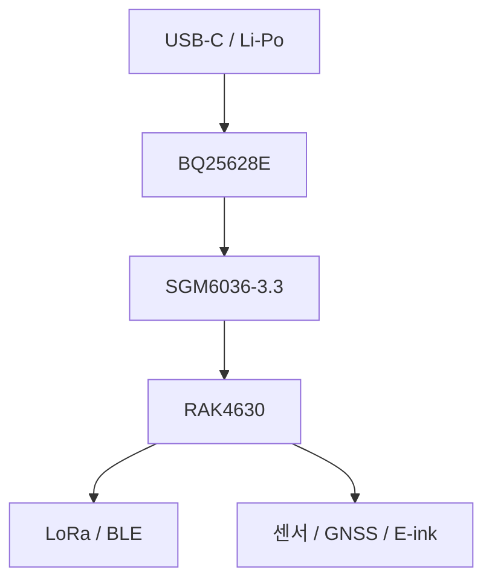

# 하드웨어 개요

## 시스템 구성

| 기능            | 부품                        | 상태    | 역할                                |
| ------------- | ------------------------- | ----- | --------------------------------- |
| 메인 MCU·LoRa   | RAK4630                   | 확정    | nRF52840 MCU와 SX1262 LoRa 트랜시버 통합 |
| Bluetooth 안테나 | RFANT5220110A0T           | 확정    | nRF52840의 Bluetooth LE용 칩 안테나     |
| E-ink         | Good Display GDEY0266T90H | 확정    | 2.66인치 360x184 흑·백 표시             |
| 온습도           | AHT20-F                   | 확정    | 필터 적용 온도·상대습도 센서                  |
| 기압            | BMP388\_TOKMAS            | 확정    | 보호 필터 적용 BMP388 계열 기압 센서          |
| 가속도           | MMA8652FC                 | 실장 계획 | 기존 MMA8653FC 자리에 드롭인 대체 예정        |
| GNSS          | ATGM336H-5NR-32           | 확정    | 다중 위성항법 위치 측정                     |
| 충전·파워패스       | BQ25628E                  | 확정    | USB 입력, 단일 셀 배터리 충전, SYS 공급       |
| 메인 3.3 V      | SGM6036-3.3               | 확정    | SYS에서 3V3\_MAIN 생성                |
| E-ink 로드 스위치  | TPS22919QDCKRQ1           | 확정    | 필요할 때만 E-ink 3.3 V 공급             |
| USB 데이터 보호    | H5VU25UC                  | 확정    | D+·D− ESD 보호                      |
| USB VBUS 보호   | H5VH16U                   | 확정    | USB 5 V 입력 ESD·과도전압 보호            |

## 메인 처리 및 무선

RAK4630은 Nordic nRF52840과 Semtech SX1262를 포함한다. nRF52840은 64 MHz Arm Cortex-M4F, 1 MB Flash, 256 KB RAM을 제공하며 Bluetooth LE와 USB, SPI, I²C, UART, GPIO를 담당한다. SX1262는 Meshtastic의 Sub-GHz LoRa 통신을 담당한다.

한국 운용을 염두에 둔 외장 LoRa 안테나는 RP-SMA 단자를 통해 연결한다. RF 경로에는 0603 크기의 π 매칭 네트워크를 두어 조립 후 측정과 튜닝 가능성을 남겼다. Bluetooth는 PCB의 RFANT5220110A0T 칩 안테나와 전용 keepout 영역을 사용한다.

## 사용자 인터페이스

- 측면 사용자 버튼 2개
- 외부에서 직접 누르지 않는 리셋 버튼
- 메인 3.3 V 변환기를 제어하는 EN 슬라이드 스위치
- 흰색 Heartbeat LED
- 노란색 충전 상태 LED
- 초록색 디버그 LED
- 투명 PLA 라이트 파이프 적용 계획

## 연결 관계

핀 번호와 GPIO 대응은 [RAK4630 핀 매핑](pin-mapping.md)에서 다룬다.
