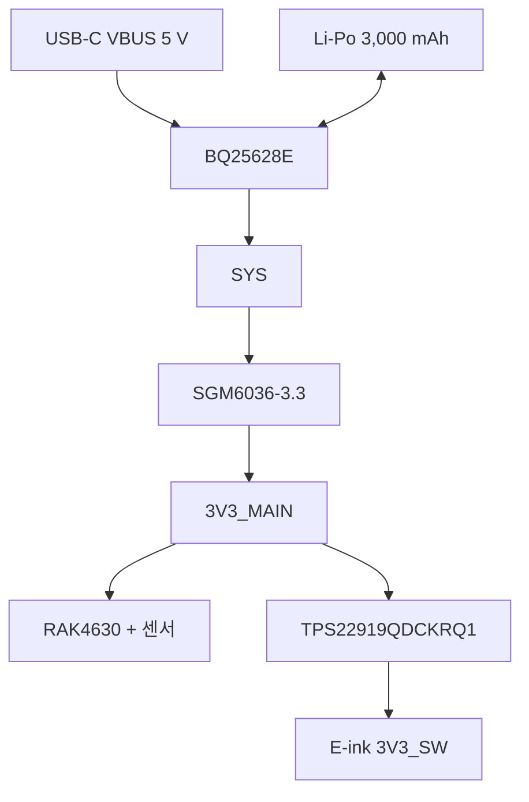

# 전원 시스템

## 전원 경로

## BQ25628E

BQ25628E는 단일 셀 리튬 이온·리튬 폴리머 배터리용 I²C 제어 충전기이자 파워패스 장치다. USB 전원이 있을 때 배터리를 충전하면서 SYS에 전력을 공급하고, USB가 없을 때는 배터리에서 SYS를 공급한다.

Ieum에서 기대하는 역할:

- USB 입력 전류 제한
- 배터리 충전 전류와 충전 전압 관리
- SYS 파워패스 제공
- 충전 및 오류 상태 확인
- ADC를 이용한 전원 상태 확인
- STAT 출력으로 노란색 충전 LED 제어
- Ship/Shutdown 계열 저전력 상태 활용

회로에 사용한 주요 값:

- ILIM: 3.3 kΩ
- TS 바이어스: 10 kΩ / TS-GND: 12 kΩ
- REGN: 4.7 µF
- PMID: 10 µF + 100 nF
- VBUS: 입력 디커플링 커패시터
- BTST: 47 nF

`INT`는 외부 pull-up을 사용하는 open-drain active-low 출력이며, TI 권장 pull-up은 10 kΩ이다. 상태 또는 fault 변경 시 기본 256 µs LOW 펄스를 출력한다. 호스트는 interrupt flag 레지스터를 읽어 원인을 확인하고, 읽은 flag는 clear된다. 전원 인가 펄스가 MCU 인터럽트 초기화보다 먼저 발생할 수 있으므로 드라이버는 시작할 때 flag와 status 레지스터를 직접 읽어 초기 상태도 확인해야 한다.

초기 펌웨어 정책은 다음과 같다.

- I²C 주소 `0x6A`와 part number field `4`를 확인한 뒤에만 레지스터를 변경한다.
- 입력 전류 제한은 500 mA로 두고, 3.3 kΩ ILIM 저항에 의한 약 0.76 A typical 하드웨어 제한도 계속 활성화한다.
- 충전 전류는 320 mA로 두고, 충전 전압은 배터리 보호를 위한 4.00 V를 Ieum 기본값으로 사용한다.
- 5 V USB-C 입력을 전제로 6.3 V 입력 과전압 보호를 선택한다.
- 첫 I²C 쓰기에서 `REG0x16[1:0]`을 `00b`로 설정해 호스트 watchdog을 비활성화하고, 칩의 safety timer, TS 감시, thermal regulation과 termination 기본 기능은 변경하지 않는다.
- InkHUD의 `Node Config → Power`에서 충전 상한을 4.00 V와 4.20 V 사이에서 전환하며, 성공한 선택은 `/prefs/bq25628e.dat`에 저장해 재부팅 후에도 적용한다.
- 저장 파일이 없거나 버전·checksum·값 검증에 실패하면 4.00 V로 복귀한다.
- ADC는 `REG0x27=0x00`으로 모든 채널을 활성화한 9-bit one-shot을 사용한다. 실기기에서 전체 채널 변환이 기존 60회 polling 제한을 넘는 것을 확인했으므로 실제 경과시간 기준 150 ms timeout을 적용하고, 완료되면 즉시 대기를 끝낸다.
- ADC 또는 초기 I²C 탐색이 실패하면 실제 0 V로 게시하지 않고 이전 정상값을 제한적으로 유지하며, BQ25628E 탐색을 주기적으로 재시도한다.
- `INT`가 누락되더라도 startup과 주기적 poll에서 read-to-clear flag, status와 fault를 읽는다. ADC 완료 인터럽트만 mask한다.
- 유효한 VBAT 측정값은 전용 배터리 레벨 어댑터를 통해 기존 배터리 전압 공급원과 같은 Power 경로에 등록한다. USB 입력이 없고 전압이 기본 OCV 최저값 3.10 V보다 11회 연속 낮으면 기존 저전압 보호가 nRF52840을 System OFF로 전환한다.
- Ship/Shutdown은 일반 종료 경로에서 자동 실행하지 않고, 별도 확인을 거친 명시적 호출로만 요청한다.

노란색 충전 LED를 제어하는 `STAT`도 open-drain 출력이며 충전 중 LOW다. 이는 nRF52840이 직접 구동하는 active-high LED 2개와 구분한다. BQ25628E는 배터리 유무를 신뢰성 있게 판별하는 전용 bit가 없으므로 USB 입력 중에는 ADC의 VBAT 값만으로 배터리 장착 여부를 추정하지 않는다. USB 입력이 없고 유효한 VBAT가 측정되면 실행 중인 Ieum의 전원이 배터리에서 공급되는 것으로 판정한다.

320 mA와 사용자가 선택한 4.00 V/4.20 V 상한은 최종 배터리 사양 검증을 대신하지 않는다. 4.00 V 모드는 USB를 장시간 연결하는 개발 환경에서 배터리의 높은 충전 상태 체류 시간을 줄이기 위한 정책이다. 실기기 충전 전에는 셀의 최대 충전 전압·허용 전류, ILIM 실측값, TS 네트워크, USB source 전압과 충전 온도를 확인한다.

## SGM6036-3.3

SGM6036-3.3은 SYS 전압을 노드의 메인 3.3 V 전원인 3V3_MAIN으로 변환한다. EN 핀은 기본 활성화되도록 풀업되어 있고, 슬라이드 스위치로 비활성화할 수 있다.

이 스위치는 배터리 도선을 직접 끊지 않는다. 따라서 3V3_MAIN이 꺼져도 BQ25628E와 배터리 충전 경로의 상태는 별도로 고려해야 한다.

## TPS22919QDCKRQ1

TPS22919-Q1은 자동차 등급의 저온저항 로드 스위치다. TPS22919DCKR 재고 문제로 Q1 제품인 TPS22919QDCKRQ1을 실장했다. Ieum에서는 E-ink 전원만 필요할 때 켜고 갱신이 끝나면 차단하는 데 사용한다.

펌웨어 요구사항:

1. 제어 GPIO를 안전한 비활성 상태로 초기화한다.
2. 로드 스위치를 켠 뒤 전원이 안정될 시간을 둔다.
3. E-ink 초기화와 화면 갱신을 수행한다.
4. bounded timeout 안에 BUSY가 해제된 것을 확인하고 패널을 deep sleep 상태로 보낸다.
5. SPI를 종료하고 SCLK, MOSI와 제어 핀을 high-Z로 만든다.
6. 로드 스위치를 끈다.

EN은 active high다. 전원 안정화 대기 시간은 실물 시험으로 확정한다. timeout이 발생하면 BUSY 중 추가 명령을 보내지 않고 SPI와 GPIO를 격리한 뒤 로드 스위치를 끈다.

## GNSS 전원

GNSS의 주 전원과 백업 전원을 구분한다. 주 전원은 위치 측정 시에만 공급하고, VBAT 백업 경로는 시간 및 위성 관련 정보를 유지해 다음 시작 시간을 줄이는 용도다. 액티브 안테나를 위한 VCC_RF 바이어스 경로에는 RF 초크와 디커플링이 있다.

## 전원 설계상 주의점

- BQ25628E의 SYS와 배터리 전압을 3V3_MAIN과 혼동하지 않는다.
- 전원이 꺼진 주변장치의 신호 핀으로 역급전하지 않도록 한다.
- 부팅 직후 E-ink와 GNSS가 의도치 않게 켜지지 않도록 GPIO 초기 상태를 먼저 정한다.
- Ship/Shutdown 동작은 EN 스위치에 의한 3V3_MAIN 차단과 별개의 기능으로 취급한다.
